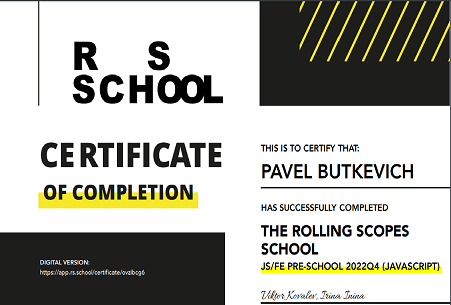

# Contact information:
<br/>

## Butkevich Pavel Aleksandrovich

###  Date of birth 19/06/1980
**E-mail:** Paveldelo@yandex.ru <br/>
**Tel:** +375 33 305 22 08 <br/>
**GitHub:** [potopus](https://github.com/potopus)<br/>
**Telegram:** [@PoulBut](https://t.me/PoulBut)<br/>
**LinkeIn:**  [павел-буткевич-46849153](linkedin.com/in/павел-буткевич-46849153)

***

## Briefly About Myself
<br/>

I study the layout and am interested in the frontend. Good skills in using HTML and CSS. General knowledge of JavaScript, Java Core. A general representation of manual QA testing.
I found and studied all the acquired knowledge from open sources.
When I found out about the RSSchool courses, I decided to take it and get enough knowledge to acquire a new specialty in the field of JS developer.


In March 2023, I completed the preparatory course JS/FE PreSchool 2022Q4 on the portal [https://app.rs.school]. At the end of the course, I have a landing page project and a desktop application, such as [https://momentumdash.com].<br/>
During this course I acquired the following skills:
* The layout of the site is made on the principle of Perfect Pixel.
* Adaptive design has been applied to the site. In the process, I learned how to position elements using Flex and Grid.
* In the project, I used pseudo-elements and CSS variables, performed responsive design using media queries.
* I expanded the functionality on the site using scripts in the JS programming language.
* When executing the momentum application, the code was structured by modules. To work with the DOM object, I used asynchronous functions. The DOM elements were accessed via the querySelector method.

The following widgets have been developed in the application:
* Welcome Widget
* Date and current time widget
* Widget for loading a random background image according to the time of day
* Widget for downloading a random quote of the day, which it receives from a JSON file
* Audio player widget. Has been developed: play/pause track, track listening progress bar, volume control, access to the track list is via JSON.
* Weather widget. Weather information is obtained through the site's API https://home.openweathermap.org/
* In the application settings menu, you can remove or add the necessary widget to the screen
* User data is stored in Local storage.

Links to a brief description of the projects are located in the Completed courses section of my CV.

***
## Skills

* HTML
    + tags
    + attributes
    + forms
* CSS
    + Selectors
    + Cascadian
    + Flex
    + Grid
* SVG
    + Sprites
* JS Core
    + Functions
    + Classes
    + DOM
    + EventLoop
    + Async/await
    + Module
    + JSON
* BEM
* Git
* Figma
* Java Core

***

## Code
<br/>

```javascript
function nearestSq(n){
    // your code
   let i=0,
  valueDwn=0,
  valueUp=0;
  if (Number.isInteger(Math.sqrt(n))){
    //console.log(n);
    return (n);
}else 
  do{
    valueUp=Math.sqrt(n+i);
    valueDwn=Math.sqrt(n-i);
    if(Number.isInteger(valueUp)){
     // console.log(n+i);
      return (n+i)
    }else
      if (Number.isInteger(valueDwn)){
        //console.log(n-i);
        return (n-i);
      }
      
    i++;
  }
while (!Number.isInteger(valueUp)&!Number.isInteger(valueDwn));
}
```
***

## Completed courses
<br/>

[Html and CSS Layout Tutorials](https://code.mu/ru/)<br/>

[Tutorial on JS - javascript.ru](https://learn.javascript.ru/)

[ Comleted JS/FE PreSchool 2022Q4](https://rs.school/js-stage0/)<br/>
<br/>


***

## Projects on GitHub
<br/>

[https://github.com/potopus/rsschool-cv.git](https://github.com/potopus/rsschool-cv.git)

### The projects after comleted JS/FE PreSchool 2022Q4:<br/>


The landing page made on the principle of Perfect Pixel. Subject - [Plants](https://rolling-scopes-school.github.io/potopus-JSFEPRESCHOOL2022Q4/plants/ )

The comleted application: [project Momentum][projectM]
Link to the analog of the application: [link to original Momentum][Tag1].


[Tag1]: [https://momentumdash.com]
[projectM]: [https://rolling-scopes-school.github.io/potopus-JSFEPRESCHOOL2022Q4/momentum/]


***

## Languages
<br/>

+ #### Russian - native
+ #### English - Intermediate


***

## Rank on Codewars
<br/>

Progress on date 05.03.2023 - 

Rank:4 kyu<br/>
Honor:949<br/>
Leaderboard Position:#28,324<br/>
Honor Percentile:Top 5.478%<br/>
Total Completed Kata:373<br/>

